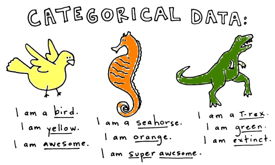
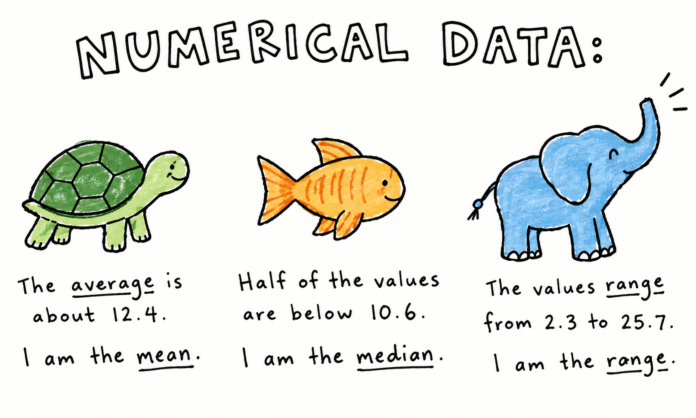
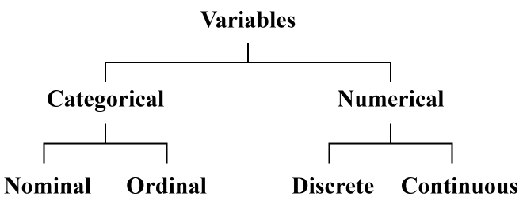

```{r}
#| label: setup

# Options ----------------------------------------------------------------------
knitr::opts_chunk$set(fig.align = "center")

# Packages ---------------------------------------------------------------------
library(dplyr)
library(tinytable)

# Data -------------------------------------------------------------------------
student_data <- readRDS(here::here("data/student_performance.RDS"))
```

## What can we learn from data

::: {.fragment .fade-up}
Imagine we want to understand **student performance**.

We collect information about students':

- Module
- Study habits
- Attendance
- Satisfaction
- Grades
:::

::: {.fragment .fade-up .center}
**We need to understand what we have collected.**
:::

## Student performance data {style="font-size: 90%;"}

<br>

```{r}
#| label: tbl-1
#| tbl-cap: "Student performance data"

# Output data as a nice table --------------------------------------------------
student_data |>
  dplyr::select(
    ID = student_id,
    programme,
    year,
    `Hours of study` = study_hours,
    `Assignments` = assignments_completed,
    satisfaction,
    passed,
    grade
  ) |>
  dplyr::rename_with(function(x) stringr::str_to_sentence(x)) |>
  dplyr::rename(ID = Id) |>
  dplyr::slice_head(n = 5) |>
  tinytable::tt() |>
  tinytable::style_tt(i = 0, bold = TRUE) |>
  tinytable::style_tt(j = 2:7, align = "c")
```


::: {.fragment .fade-up .center}
What does **each row** of the above data represent?
:::

::: {.fragment .fade-up .center}
**One student**
:::

:::: {.fragment .fade-up}
::: {.callout-note}
## We call this one observation an **"observational unit"**.
:::
::::

## Observational units

The **observational unit** is the thing we are collecting information about.

::: {.fragment .fade-up}
In our dataset

> **One row = one student**
:::

::: {.fragment .fade-up}
But observational units could also be:

- One **patient**
- One **company**
- One **experiment**
:::

::: {.notes}
- Observational units are basically the **thing we are interested in**
:::

## Variables describe observations

Each **row** in our dataset represents a **student**

Each **column** describes something about that student
(this is called a **variable**).

<br>

```{r}
#| label: tbl-2
#| tbl-cap: "A single students performance"

# Output data as a nice table --------------------------------------------------
student_data |>
  dplyr::select(
    ID = student_id,
    programme,
    year,
    `Hours of study` = study_hours,
    `Assignments` = assignments_completed,
    satisfaction,
    passed,
    grade
  ) |>
  dplyr::rename_with(function(x) stringr::str_to_sentence(x)) |>
  dplyr::rename(ID = Id) |>
  dplyr::slice_head(n = 1) |>
  tinytable::tt() |>
  tinytable::style_tt(i = 0, bold = TRUE) |>
  tinytable::style_tt(j = 2:7, align = "c")
```

<br>

:::: {.fragment .fade-up}
::: {.callout-important}
## However, not all variables are treated the same

Variables can be split into two categories: [categorical variables]{.alert} and
[numerical variables]{.alert}.
:::
::::

:::{.notes}
- Categorical variables **describe something**
- Numerical variables **quantify something**
:::

## Categorical versus numerical variables {style="font-size: 70%;"}

::::: {.columns}
:::: {.column}
Categorical variables tell us **which group an observation belongs to**.



::: {.callout-tip}
## Useful way to remember

Ask yourself, *"which group does this observation belong to"*?
:::
::::

:::: {.column}

:::: {.fragment .fade-left}
Numerical variables represent **quantities** and provide us with a
**quantitative observation**.



::: {.callout-tip}
## Useful way to remember

Ask yourself, *"how many or much much"*?
:::
::::

::::
:::::

## Exercise: Categorical or numerical

::::: {.columns}
:::: {.column}

**Classify each variable**:

1. Programme
2. Age
3. Satisfaction
4. Study hours
5. Passed
6. Grade
7. Assignments completed

::::

:::: {.column}

**Variable classification**:

::: {.incremental}
1. Categorical
2. Numerical
3. Categorical
4. Numerical
5. Categorical
6. Numerical
7. Numerical
:::

::::
:::::

## Categorical data

### A further breakdown

Some categorical variables are **nominal**, while others are **ordinal**

::: {.fragment .fade-up}
**Nominal variables**

Nominal variables are **purely descriptive**.

- **Programme:** Statistics / Psychology / Biology / Computer Science

:::

::: {.fragment .fade-up}
**Ordinal variables**

Ordinal variables can be put into a **meaningful order**.

- **Satisfaction:** Dissatisfied → Neutral → Satisfied

:::

## Numerical data

### A further breakdown

Some numerical variables are **discrete**, while others are **continuous**.

::: {.fragment .fade-up}
**Discrete variables**

These are countable values with **fixed values**

$$
0, 1, 2, 3, 4, 5, \dots, 10
$$

:::

::: {.fragment .fade-up}
**Continuous variables**

These are variables with **no fixed interval**

$$
5, 5.1, 5.12, 5.123, 5.1234, \dots, \infty
$$

:::

## Exercise: Categorical or numerical

::: {.columns}

::: {.column}

**Classify each variable:**

1. Programme
2. Age
3. Satisfaction
4. Study hours
5. Passed
6. Grade
7. Assignments completed

:::

::: {.column}

**Variable classification:**

::: {.incremental}
1. Categorical - **Nominal**
2. Numerical - [Continuous]{.alert}
3. Categorical - **Ordinal**
4. Numerical - **Continuous**
5. Categorical - [Binary]{.alert}
6. Numerical - **Continuous**
7. Numerical - **Discrete**
:::

:::
:::

---

<br>

<br>



## So, why does all this matter {style="font-size: 90%;"}

Different types of variables require different ways of describing them.

::: {.fragment .fade-up}

**Categorical variables** can be represented as

- **Frequencies**
- **Proportions**
- **Bar charts**

:::

::: {.fragment .fade-up}

**Numerical variables** can be represented as

- **Summary statistics**
- **Histograms**
- **Empirical Cumulative Distribution Functions (ECDF)**

:::

## Representing categorical variables

### Frequencies

Let's consider the number (frequency) of students in each module.

```{.r filename="frequencies.R"}
table(student_data$programme)
```

```{r}
#| label: categorical-frequencies
student_data |>
  dplyr::count(programme) |>
  rename(Programme = programme) |>
  tt() |>
  style_tt(i = 0, bold = TRUE) |>
  style_tt(j = 2, align = "c")
```

## Representing categorical variables

### Proportions

Let's consider the relative frequency (proportion) of students in each module

```{.r filename="proportion.R"}
N <- nrow(student_data)
module_table <- table(student_data$programme)
module_table/N
```

```{r}
#| label: categorical-proportions
student_data |>
  count(programme) |>
  mutate(n = n / sum(n)) |>
  rename(Programme = programme, Proportion = n) |>
  tt() |>
  style_tt(i = 0, bold = TRUE) |>
  style_tt(j = 2, align = "c")
```

## Representing categorical variables

### Bar charts

This time, let's represent the number of students in each module as a graph.

```{.r filename="barchart.R"}
module_table <- table(student_data$programme)
barplot(module_table)
```

```{r}
#| label: categorical-barchart
table(student_data$programme) |> barplot()
```

::: {.notes}
- Sometimes, tables are boring and we'd rather represent our data using a graph
:::

## Representing numerical variables

Let's consider the frequency of individual grades each student got

```{r}
#| label: numerical-frequencies
table(student_data$grade)
```

There are **84 individual unique grades** in this dataset.

<br>

:::: {.fragment .fade-up}
::: {.callout-note icon="false"}
## Does it make sense to tabulate this data?
:::
::::

## Let's try it!

```{r}
#| label: numerical-barplot
table(student_data$grade) |> barplot()
```

::: {.notes}
- Wow, this looks horrible!!
:::

## Representing numerical variables

### Histograms

```{.r filename="histogram.R"}
hist(student_data$grade)
```

```{r}
#| label: numerical-histogram
hist(student_data$grade)
```

::: {.notes}
- Histograms collapse the values into groups (we call these bins)
:::

## Representing numerical variables

### Empirical cumulative distribution functions

An ECDF can be used to obtain the relative frequencies for values contained
within certain intervals

$$
60, 60, 65, 65, 75, 80, 80, 90, 95, 100
$$

From the above 10 grades we can see that

- 20% are equal to or below 60
- 50% are equal to or below 75
- 100% are equal to or below 100

::: {.notes}
- ECDFs tell us the proportion of values within a certain interval
:::

## Representing numerical variables

### Empirical cumulative distribution functions

```{r}
#| label: small-ecdf
grades_10 <- c(60, 60, 65, 65, 75, 80, 80, 90, 95, 100)

plot.ecdf(grades_10)
```

## Representing numerical variables

### Empirical cumulative distribution functions

```{.r filename="ecdf.R"}
plot.ecdf(student_data$grade)
```

```{r}
#| label: big-ecdf
plot.ecdf(student_data$grade)
```

## Wrapping up {style="font-size: 85%;"}

- **Variables describe observations** in data.
- Variables can be either **categorical** or **numerical**.
- Categorical variables can be either **nominal** or **ordinal**.
- Numerical variables can be either **discrete** or **continuous**.
- Categorical and numerical variables are **represented in different ways**.

:::: {.columns}
::: {.column}

:::

::: {.column}

:::
::::

## Further reading

Chapters 1 & 2 of [Introduction to Statistical and Data Analysis](https://www.academia.edu/42933729/Introduction_to_Statistics_and_Data_Analysis_With_Exercises_Solutions_and_Applications_in_R#outer_page_15) by Christian Heimann & Michael Schomaker Shalabh

<br>

::: {.callout-tip icon="false"}
## Slightly more advanced reading

For those of you who are really interested in this topic I would recommend
Chapters 1 & 2 of [OpenIntro Statistics](https://leanpub.com/os) by
David Diez, Mine Cetinkaya-Rundel, and Christopher Barr.

**It's completely free to download**
:::
