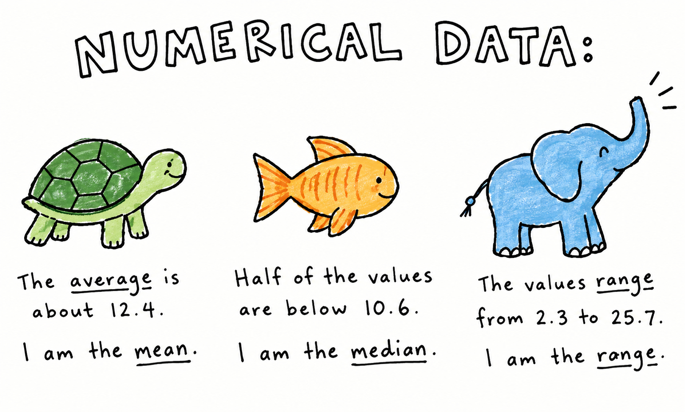
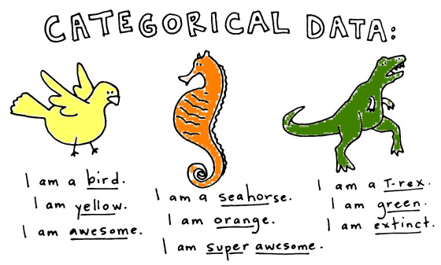

```{r}
#| label: setup

set.seed(4321)

# Options ----------------------------------------------------------------------
knitr::opts_chunk$set(fig.align = "center")

# Packages ---------------------------------------------------------------------
library(dplyr)
library(ggplot2)
library(tinytable)

# Data -------------------------------------------------------------------------
airlines <- readRDS(here::here("data/airline.RDS"))
```

## Recap

Last week we covered

- Means and medians
- Quantiles
- Range, IQR, variance, and standard deviations
- Histograms and boxplots
- Scatter plots (briefly)

::: {.callout-important}
## Check in: Was there anything from last week that was confusing or unclear?
:::

## Plan for today {style="font-size: 80%;"}

Today we will learn how to:

- Represent categorical data using a **contingency table**
- Describe **marginal** and **conditional** distributions
- Visualise the relationship between two categorical variables
- Understand **independence**
- Calculate **expected counts**
- Quantify the difference between observed and expected counts using the
  **$\chi^2$ statistic**
- Use a $\chi^2$ test to assess **evidence of an association**

## Research question {style="font-size: 80%;"}

Imagine we surveyed **100 airline passengers**.

We recorded:

- **Travel class**
  - Business
  - Economy
- **Satisfaction**
  - Very poor
  - Fair
  - Good
  - Very good

{.absolute width=515.8px height=261.5px left=474.8px top=215.2px}

:::: {.fragment .fade-up}
::: {.callout-note}
## Research question: Is satisfaction related to travel class?
:::
::::

---

<br>
<br>
<br>

:::: {.columns}

::: {.column}



:::

::: {.column}



:::

::::

## Airline satisfaction data

<br>

```{r}
#| label: airline-data

airlines |>
  rename_with(function(x) stringr::str_to_sentence(x)) |>
  slice_sample(n = 6) |>
  tt() |>
  style_tt(i = 0, bold = TRUE) |>
  style_tt(j = c(1, 2), align = "c")
```

<br>

::: {.callout-important icon="false" appearance="simple"}
## Both of these variables are categorical

How would we analyse such data?
:::

## Contingency tables

A contingency table shows the **frequency** of observations for
**every combination of categorical variables**.

```{.r filename="contingency.r"}
table(airlines)
```

```{r}
#| label: contingency-table-1a
airlines |>
  count(class, satisfaction) |>
  rename(Class = class) |>
  tidyr::pivot_wider(names_from = "satisfaction", values_from = "n") |>
  tt() |>
  style_tt(i = 0, bold = TRUE) |>
  style_tt(j = c(2:5), align = "c")
```

<br>

::: {.callout-note}
## A contingency table lets us see the joint distribution of two categorical variables.
:::

## Contingency tables

A contingency table shows the **frequency** of observations for
**every combination of categorical variables**.

```{.r filename="contingency.r"}
table(airlines)
```

```{r}
#| label: contingency-table-1b
airlines |>
  count(class, satisfaction) |>
  rename(Class = class) |>
  tidyr::pivot_wider(names_from = "satisfaction", values_from = "n") |>
  tt() |>
  style_tt(i = 0, bold = TRUE) |>
  style_tt(j = c(2:5), align = "c") |>
  style_tt(i = c(1, 2), j = c(1:5), color = "#99999966") |>
  style_tt(i = 1, j = 4, color = "#0047AB", bold = TRUE)
```

<br>

::: {.callout-note}
## A contingency table lets us see the joint distribution of two categorical variables.
:::

## Marginal distributions

::: {.callout-note icon="false" appearance="simple"}
## Marginal distributions tell us:

How common is each category, ignoring the other category?
:::

::: {.callout-caution icon="false" appearance="simple"}
## What proportion of all passengers reported "Very Good" satisfaction?
:::

::: {.callout-caution icon="false" appearance="simple"}
## What proportion of passengers travelled in Business class?
:::

::: {.fragment .fade-up}

```{.r filename="marginal.R"}
addmargins(table(airlines))
```

```{r}
#| label: marginal-data

# Summary table to be added on
margins <- tribble(
  ~Class , ~Poor , ~Fair , ~Good , ~`Very Good` , ~Sum ,
  "Sum"  ,    23 ,    22 ,    24 ,           30 ,  100
)

# Create nice table ------------------------------------------------------------
airlines |>
  count(class, satisfaction) |>
  rename(Class = class) |>
  tidyr::pivot_wider(names_from = "satisfaction", values_from = "n") |>
  mutate(Sum = rowSums(across(where(is.numeric)))) |>
  bind_rows(margins) |>
  tt() |>
  style_tt(i = 0, bold = TRUE) |>
  style_tt(j = c(2:5), align = "c") |>
  style_tt(i = 2, line = "b") |>
  style_tt(j = 5, line = "r")
```

:::

::: {.notes}
- The row totals tell us the marginal distribution of travel class.
- The column totals tell us the marginal distribution of satisfaction.
:::

## Conditional distributions {style="font-size: 90%;"}

::: {.callout-note icon="false" appearance="simple"}
## Conditional distributions tell us:

What proportion of each class gave each satisfaction rating?
:::

::: {.callout-caution icon="false" appearance="simple"}
## Out of all the people in Class B, how many people were very satisfied?
:::

::: {.callout-caution icon="false" appearance="simple"}
## Out of all the people in Class E, how many people were fairly satisfied?
:::

::: {.callout-tip icon="false" appearance="simple"}
## Essentially, we are ignoring the other group
:::

::::: {.fragment .fade-up}
:::: {.columns}

::: {.column}

[**Marginal distribution**]{.center}

$$
\frac{\text{Very good passengers}}{\text{All passengers}}
$$

:::

::: {.column}

[**Conditional distribution**]{.center}

$$
\frac{\text{Very good business passengers}}{\text{All business passengers}}
$$

:::

::::
:::::

## Conditional distributions {style="font-size: 90%;"}

```{.r filename="conditional.r"}
# There are two ways to achieve this

# METHOD 1 - CALCULATING MANUALLY ----------------------------------------------
tab <- table(airlines)

# The probability of satisfaction conditional on Business class
# The first row divided by the sum of the first row
cond_prob_B <- tab[1, ] / sum(tab[1, ])

# The probability of satisfaction conditional on Economy class
# The second row divided by the sum of the second row
cond_prob_E <- tab[2, ] / sum(tab[2, ])

# METHOD 2 - LET R DO IT FOR YOU -----------------------------------------------
tab <- table(airlines)
prop.table(tab, margin = 1)
```

```{r}
#| label: conditional-table
airlines |>
  count(class, satisfaction) |>
  group_by(class) |>
  mutate(n = n / sum(n)) |>
  rename(Class = class) |>
  tidyr::pivot_wider(names_from = "satisfaction", values_from = "n") |>
  tt() |>
  style_tt(i = 0, bold = TRUE) |>
  style_tt(j = c(2:5), align = "c")
```

## Visualising conditional distributions

```{r}
#| label: bar-plots
# Making data for plotting
plotting_data <- airlines |>
  count(class, satisfaction) |>
  group_by(class) |>
  mutate(prop = n / sum(n))

# Stacked barplot --------------------------------------------------------------
fig_1 <- plotting_data |>
  ggplot(aes(x = class, y = n, fill = satisfaction)) +
  geom_bar(stat = "identity", colour = "black") +
  ggokabeito::scale_fill_okabe_ito() +
  labs(
    title = "Stacked barplot",
    x = "Class",
    y = NULL,
    fill = "Satisfaction"
  ) +
  theme_bw()

# Conditional ------------------------------------------------------------------
fig_2 <- plotting_data |>
  ggplot(aes(x = class, y = n, fill = satisfaction)) +
  geom_bar(stat = "identity", position = "dodge", colour = "black") +
  ggokabeito::scale_fill_okabe_ito() +
  labs(
    title = "Grouped barplot",
    x = "Class",
    y = NULL,
    fill = "Satisfaction"
  ) +
  theme_bw()

# Output -----------------------------------------------------------------------
ggpubr::ggarrange(plotlist = c(fig_1, fig_2), common.legend = TRUE)
```

::: {.callout-important appearance="minimal"}
## Which plot does a better job of answering the research question

Does satisfaction differs between classes?
:::

## Visualising conditional distributions

```{.r filename="barplots.R"}
# How to make the bar plots (colours are omitted as I used a slightly different method)

tab <- table(airline) # Make a contingency table

# STACKED BARPLOT
barplot(
  t(tab),
  legend = TRUE,
  args.legend = list(x = "top", ncol = 2),
  ylim = c(0,95)
)

# GROUPED BARPLOT
barplot(
  t(tab),
  beside = TRUE, # This argument is the key difference
  legend = TRUE,
  args.legend = list(x = "topleft", ncol = 1),
  ylim = c(0,40)
  )
```

---

:::: {.callout-important icon="false"}
## What would we see if class didn't matter?

[Let's say that 15% of all passengers report "Poor" satisfaction.]{.center}

<br>

If **travel class** has [nothing]{.alert} to do with **satisfaction**, what
percentage of **Business passengers** should we expect to report
**poor satisfaction**?

::: {.fragment .fade-up}
15%
:::


<br>

::: {.fragment .fade-up}
And what about in **Economy class**?
:::

::: {.fragment .fade-up}
15%
:::
::::

:::: {.fragment .fade-up}
::: {.callout-tip icon="false"}
## Independence

Two categorical variables are independent when knowing the category of one variable gives us no information about the category of the other.

If **Class** and **Satisfaction** were independent, the **distribution** of
satisfaction should [be the same]{.alert} in Business and Economy.
:::
::::

::: {.notes}
- P(Poor) = 0.15
- P(Poor | Business) = 0.15
- P(Poor | Economy) = 0.15
- **The same idea applies to every satisfaction category**
:::

## Expected counts {style="font-size: 90%;"}

<br>

```{r}
#| label: observed-counts-1a
airlines |>
  count(class, satisfaction) |>
  rename(Class = class) |>
  tidyr::pivot_wider(names_from = "satisfaction", values_from = "n") |>
  tt() |>
  style_tt(i = 0, bold = TRUE) |>
  style_tt(j = c(2:5), align = "c")
```

<br>

::: {.callout-note icon="false"}
## What would out airline data look like if class had no effect on satisfaction

$$
E_{ij} = \frac{(\text{Row}_i \; \text{total}) \times \text{(Column}_j \; \text{total)}}{\text{Grand total}}
$$
:::

<br>


::: {.fragment .fade-up}

```{r}
#| label: expected-counts-1a
airlines |>
  table() |>
  chisq.test() |>
  purrr::pluck("expected") |>
  as_tibble() |>
  mutate(Class = c("B", "E")) |>
  relocate(Class) |>
  tt() |>
  style_tt(i = 0, bold = TRUE) |>
  style_tt(j = c(2:5), align = "c")
```

:::

::: {.notes}
- Example: (row_i * col_j) / N = (50 * 24) / 100
:::

## Observed versus expected counts

:::: {.columns}
::: {.column}

[**What actually happened**]{.center}

```{r}
#| label: observed-counts-1b
airlines |>
  count(class, satisfaction) |>
  rename(Class = class) |>
  tidyr::pivot_wider(names_from = "satisfaction", values_from = "n") |>
  tt() |>
  style_tt(i = 0, bold = TRUE) |>
  style_tt(j = c(2:5), align = "c")
```

:::

::: {.column}

[**If independence was assumed**]{.center}

```{r}
#| label: expected-counts-1b
airlines |>
  table() |>
  chisq.test() |>
  purrr::pluck("expected") |>
  as_tibble() |>
  mutate(Class = c("B", "E")) |>
  relocate(Class) |>
  tt() |>
  style_tt(i = 0, bold = TRUE) |>
  style_tt(j = c(2:5), align = "c")
```

:::
::::

::: {.fragment .fade-up}

- For each cell, we can calculate $O_{ij} - E_{ij}$
- If $O_{ij} = E_{ij}$ then that cell is exactly what independence predicts
- If $O_{ij} \ne E_{ij}$ then that cell contributes evidence that the variables
  may not be independent.

:::

## The $\chi^2$ statistic {style="font-size: 95%;"}

### How different are observed counts and expected counts?

We need a single number that summarises how different our observed counts are
from the counts we'd expect under independence.

$$
\chi^2 = \sum_i \sum_j \frac{(O_{ij} - E_{ij})^2}{E_{ij}}
$$

- Small $\chi^2$: Observed counts are relatively close to expected counts.
- Large $\chi^2$: Observed counts are far from expected counts.

::: {.callout-tip}
## Larger $\chi^2$ values indicate greater disagreement between observed and expected counts.
:::

::: {.callout-note}
## How do we determine what is a large $\chi^2$ value?
:::

## The $\chi^2$ distribution {style="font-size: 80%;"}

The **$\chi^2$ test statistic** has a mathematical distribution called the <br>
**$\chi^2$ distribution**.

- The important specification to make in describing the $\chi^2$ distribution
  is something called [degrees of freedom]{.alert}.
- Different $\chi^2$ distributions correspond to different degrees of freedom

```{r}
#| label: chi-plot
#|
set.seed(1234)

# Make some chi distribution data ----------------------------------------------
chi_data <- tibble(
  chi_3 = rchisq(10000, 3),
  chi_5 = rchisq(10000, 5),
  chi_10 = rchisq(10000, 10),
  chi_20 = rchisq(10000, 20),
) |>
  tidyr::pivot_longer(
    cols = everything(),
    names_to = "chi",
    values_to = "val"
  ) |>
  mutate(
    chi = stringr::str_replace(chi, "_", " "),
    chi = factor(chi, levels = paste("chi", c(3, 5, 10, 20)))
  )

# Plot the data ----------------------------------------------------------------
chi_data |>
  ggplot(aes(x = val, colour = chi)) +
  geom_density(linewidth = 0.8) +
  ggokabeito::scale_colour_okabe_ito() +
  labs(x = NULL, y = "Density", colour = "Degrees of \nFreedom") +
  theme_classic() +
  theme(legend.title = element_text(hjust = 0.5))
```

## Degrees of freedom

[**How many cells can vary freely once the totals are fixed?**]{.center}

Once you know the row $(R)$ and column $(C)$ totals, not every cell can vary
independently.

$$
DF = (R - 1)(C - 1)
$$


::: {.fragment .fade-up}
Looking back at our airline example, we had **2 rows and 4 columns**

$$
DF = (2 - 1)(4 - 1) = 3
$$

:::

## Hypothesis testing

Once we have a research question, we can do a **hypothesis test**.

::: {.callout-note icon="false"}
## Is airline class associated with satisfaction?
:::

<br>

:::: {.fragment .fade-up}
::: {.callout-tip icon="false"}
## Null hypothesis

Class and satisfaction **are independent**.
:::
::::

:::: {.fragment .fade-up}
::: {.callout-tip icon="false"}
## Alternative hypothesis

Class and satisfaction **are associated**.
:::
::::

<br>

:::: {.fragment .fade-up}
::: {.callout-caution icon="false"}
## If the null hypothesis were true, how surprising would our observed table be?
:::
::::

---

```{.r filename="chi-square.R"}
tab <- table(airlines)
chisq.test(tab)
```

```{r}
#| label: chisq-test
tab <- table(airlines)
chisq.test(tab)
```

```{r}
chi_data |>
  filter(chi == "chi 3") |>
  ggplot() +
  geom_density(
    aes(x = val),
    linewidth = rel(0.75),
    colour = "black",
    fill = "#E69F00",
    alpha = 0.5
  ) +
  geom_vline(
    xintercept = 43.245,
    linetype = "dashed",
    colour = "grey25"
  ) +
  theme_bw()
```

## So ... Does travel class matter

<br>

We found evidence of an **association** between travel class and satisfaction.

::: {.callout-note}
## Satisfaction differs between Business and Economy passengers.
:::

<br>

:::: {.fragment .fade-up}
::: {.callout-important}
## Association does not automatically imply causation.
:::

We have **not demonstrated** that changing someone's travel class would cause
their satisfaction to change.
::::


## Wrapping up

- We learned how to represent categorical data using a **contingency table**.
- We learned the difference between **marginal** and **conditional** frequencies.
- **Expected** versus **observed** counts
- $\chi^2$ statistic

::: {.callout-tip icon="false"}

## Recommended reading

Chapters 4 and 5 of [Introduction to Statistical and Data Analysis](https://www.academia.edu/42933729/Introduction_to_Statistics_and_Data_Analysis_With_Exercises_Solutions_and_Applications_in_R#outer_page_77) by Christian Heimann & Michael Schomaker Shalabh

:::
